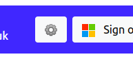

# Augmented Reality Telepresence for *Double 3*
## Overview
## Table of contents
* [Deploying the project](#deploying-the-project)
* [System configuration](#system-configuration)
* [Technical description](#technical-description)
* [Limitations and trade-offs](#limitations-and-trade-offs)
## Deploying the project

### 1. Domain and HTTPS configuration
> The system must be deployed using HTTPS, as modern browsers do not allow access to the [`MediaDevices`](https://developer.mozilla.org/en-US/docs/Web/API/MediaDevices) interface over unencrypted HTTP.

Currently [server.js](server.js) is configured to serve HTTPS to your domain via [Greenlock](https://www.npmjs.com/package/greenlock). If your usage complies with the [Let's Encrypt Subscriber Agreement](https://letsencrypt.org/documents/), you can reconfigure this for your requirements.

Simply set the constant at [server.js#L2](server.js#L2) to your email address, then use the following command from the root directory to add your domain(s).

`npx greenlock add --subject example.com --altnames example.com`

A full *Greenlock* start guide can be found [here](https://www.npmjs.com/package/greenlock-express) if the above is oversimplified.

Alternative HTTPS deployment methodologies will require [server.js](server.js) to be refactored.

### 2. *Microsoft Azure* app registration
> In order to enable [*Microsoft* Teams features](#microsoft-teams-presence-cards), the system queries the [*Microsoft Graph* API](https://docs.microsoft.com/en-us/graph/use-the-api) on behalf of an [authenticated user](#microsoft-account-authentication) via a [*Microsoft Azure* app](#microsoft-azure-app-registration). 

You must register an app within the [*Microsoft* Organization intended for deployment](#organization-assignment) and give the system its details. Full instructions for app registration [are here](https://docs.microsoft.com/en-us/graph/auth-register-app-v2).

Once registered, the constant at [ms-queries.js#L1](#ms-queries.js#L1) must be set to the **Application (client) ID** and [ms-queries.js#L2](#ms-queries.js#L2) must be set to a generated client secret. These can be found and generated respectively via the configuration page for the app on the [*Microsoft Azure*](https://portal.azure.com/) website.

### 3. *Microsoft* account configuration
> This system uses the [*Microsoft* Identity Platform](https://docs.microsoft.com/en-us/azure/active-directory/develop/) for account management, profile integration (e.g., display pictures), and to authenticate the associated [*Microsoft Azure* app](#microsoft-azure-app-registration).

#### Organization assignment
Currently, each deployment of the system will only work with one *Microsoft* Organization at a time (and its instantiated robots, smart actions, etc.).

If an Organization is not defined in [db.json](db/db.json) (the default), you must enter the *Microsoft* **Tenant ID** of the intended Organization into the relevant object in [db.json](db/db.json) before deployment.

The easiest way to find this is to login to [*Microsoft Azure*](https://portal.azure.com/), and navigate to *Azure Active Directory* via the sidebar. The **Tenant ID** of the Organization associated with your account is listed here.

#### Admin accounts
Admins can access an additional interface from the *Robot Select* screen, via the cog icon, which allows GUI configuration of much of the system.

If there are no admins defined in [db.json](db/db.json)  (the default), the first user who logs in will be automatically set as an admin (as well as a [driver](#driver-accounts)).

Further admins can be defined by entering their *Microsoft* account **GUID** in the relevant array in [db.json](db/db.json).

#### Driver accounts
Any *Microsoft* account within the [defined Organization](#organization-assignment) can login and use the system to drive robots.

First-time users will be required to allow certain data access permissions, listed below, and explained [here](https://docs.microsoft.com/en-us/graph/permissions-reference).

- **User.ReadBasic.All**
- **Presence.Read.All**
- **Chat.Read**
- **Chat.ReadBasic**
- **Chat.ReadWrite**
- **ChatMessage.Send**

Please note that non-admin users can allow these permissions in *Microsoft* Organizations by default, but  Organization administrators can manually limit non-admin permissions, which would prevent access to the system in its current state.

### 4. Starting the server
> Broadly speaking, the system consists of a [*NodeJS*](https://nodejs.org/en/) server serving [*Embedded JavaScript*](https://ejs.co/) to the user (and robots), using [*ExpressJS*](https://expressjs.com/) for routing. Packages are managed via [*npm*](https://www.npmjs.com/).

Using a standard *npm* workflow, you should simply be able to [install *NodeJS* and *npm*](https://docs.npmjs.com/downloading-and-installing-node-js-and-npm), navigate to the directory, and run `sudo npm start` to deploy.

Alternatively, run the following command for live development. This will restart the server whenever there are file changes.

`sudo npm run dev`

The project only has precedent on a *Ubuntu* server but it is, in principle, multi-platform.

## System configuration
### *Double 3* robots
### Rear-view cameras
### Physical hand-raising
### *IFTTT* smart actions
### *Microsoft Teams* presence cards

## Technical description
The *Double 3* frontend, [robot.ejs](views/robot.ejs), is served to the robot as a standard webpage via an [*Electron*](https://www.electronjs.org/) browser window. Each *Double 3* is given its identity via its UUID being given in the URL, `.../robot/[UUID]`, which is **private** and only visible serverside and [to admins](#double-3-robots).

> The driver frontend establishes a relationship with a specific *Double 3* via the MD5 hash of a robot's UUID in the URL, `.../[MD5_OF_UUID]`.

## Limitations and trade-offs
### Battery life
The *Double 3* can deploy 1 of 4 performance models, ranging from **lowest** to **highest**. To the best of my knowledge, this effects the number of active CPU cores, and the clock speeds of the CPU cores and the GPU. Both the CPU and GPU are in the so-called *head*, and this setting does not effect the *base* in any way.

The stock *Double 3* endpoint (i.e., [https://drive.doublerobotics.com/](https://drive.doublerobotics.com/)) is optimised to work with the **lowest** performance model.

With the added functionality and in this project, the processing load is higher than the stock *Double 3* endpoint. As such, **high** performance is enabled for single-camera operation, and the **highest** performance is enabled with the addition of a [rear-view camera]().

This measurably reduces battery life. The **average time** taken to drain the battery from **100%** to **90%** across 3 scenarios is listed below. Each scenario was tested 3 times; the *Double 3* was left parked during a call (i.e., not driven) during each test.

| Endpoint | Performance mode | 100%-90% drain time |
| -------- | ---------------- | ------------------- |
| *Stock*  | *Lowest*         | *Xm Xs*             |
| ART      | High (1 cam)     | 13m 32s             |
| ART      | Highest (2 cams) | Xm Xs               |

### CPU/GPU performance limits

### Bandwidth minimisation

### Accessory weight limitations
The *Double 3* has three mounting screw holes in its head, two on the very top under the rubber guard, and one behind the port cover on the back.

The [mounting bracket]() supplied in this documentation attaches to the two upmost screw holes.

Objects rigidly attached this bracket, seemingly regardless of placement in reference to the centre of gravity, risk making the *Double 3* **dangerously unstable** if they weigh in excess of approximately **0.6kg** (excluding the bracket). This was tested in 0.1kg increments.

The 'point-of-failure' is the stability of the *head* itself, which starts violently vibrating when tolerances are exceeded, seemingly to the point of structural damage were it be allowed to continue.

> A possible solution for greater weights might be to attach accessories to the pole connecting the *head* and *base* via a clamp, whereby the lower they are, the more stable the robot will be. 